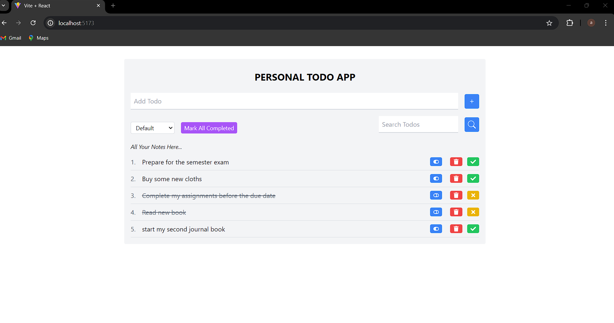

# Personal Todo App 

## Overview

Welcome to our Todo App project! In this project, you'll learn how to build a cool Todo application using React, Redux, and Tailwind CSS. This project is perfect for both beginners and experienced developers who want to understand the core concepts of Redux, including actions, reducers, and store management.

## Features

- **Add Tasks**: Easily add new tasks to your todo list.
- **Filter Tasks**: Filter tasks based on their status (completed or not).
- **Toggle Tasks**: Mark tasks as completed or not completed.
- **Responsive Design**: Enjoy a beautiful, responsive design with Tailwind CSS.

## Technologies Used

- **React**: A JavaScript library for building user interfaces.
- **Redux**: A predictable state container for JavaScript apps.
- **Tailwind CSS**: A utility-first CSS framework for rapid UI development.

